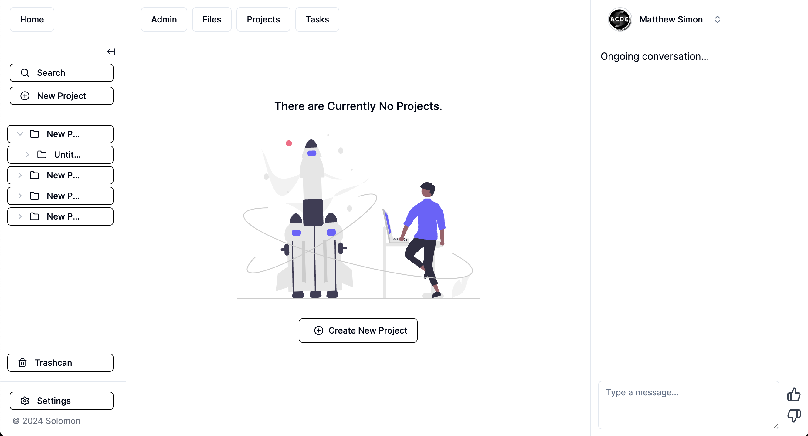

# Welcome to Solomon-electron: Incorporating AI w/ Project-Management

<h2>MITP: Management Information Training & Personalization</h2>

         

* Solomon-MITP: Empowering projects with artificial intellegence. 
* MITP: Stands for Management Information Training & Personalization.
* Vector-db: Convex DaaS 
* Objective: 

Solomon aims to be the project-management assistant which connects the dots which otherwise may have been undiscoverable. By implmenting project-content into the information retrieval process, we're able to keep steady with LLM development and use the ongoign progress as a continuous tool for assisting in project development, general assistance, and management techniques which wil lead to succesfull outcomes sooner. 

<h2>What is Solomon?</h2>
  

<h2>How Does It Work?</h2>

<h2>Why Solomon-Electron?</h2>

Medex aims to make healthcare information more accessible, understandable, and user-friendly. It's about breaking barriers between people and the medical information they need, empowering individuals to make informed health decisions.

<h2>Join the Mission. 🤝</h2>

<h2>Getting Started w/ Solomon-Electron 🚀🚀🚀</h2> 

<h1>Final Words</h1>

Welcome to the Solomon-Electron community! We're thrilled to have you here and we can't wait to see how you contribute to this project. 
